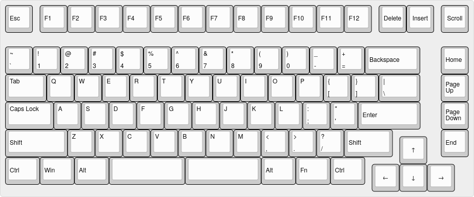
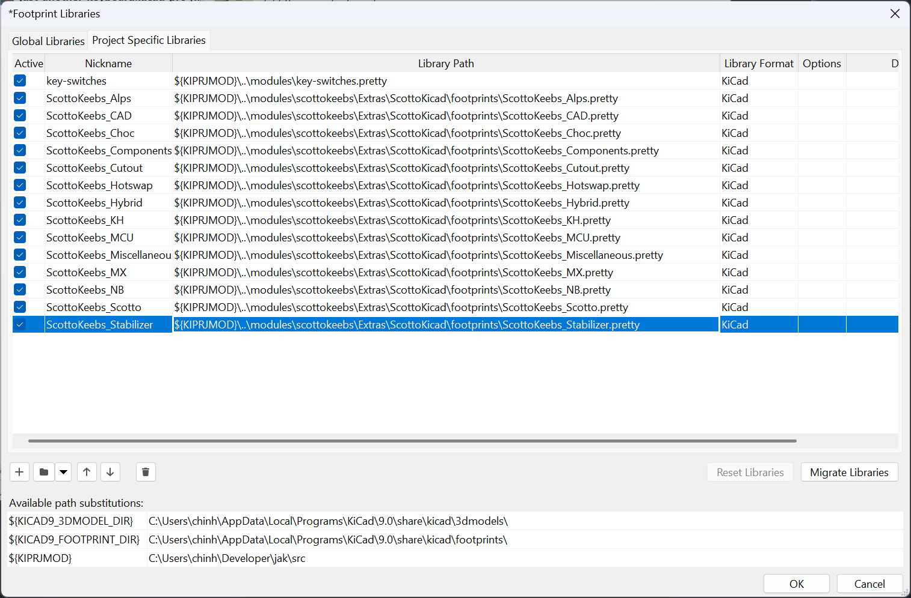
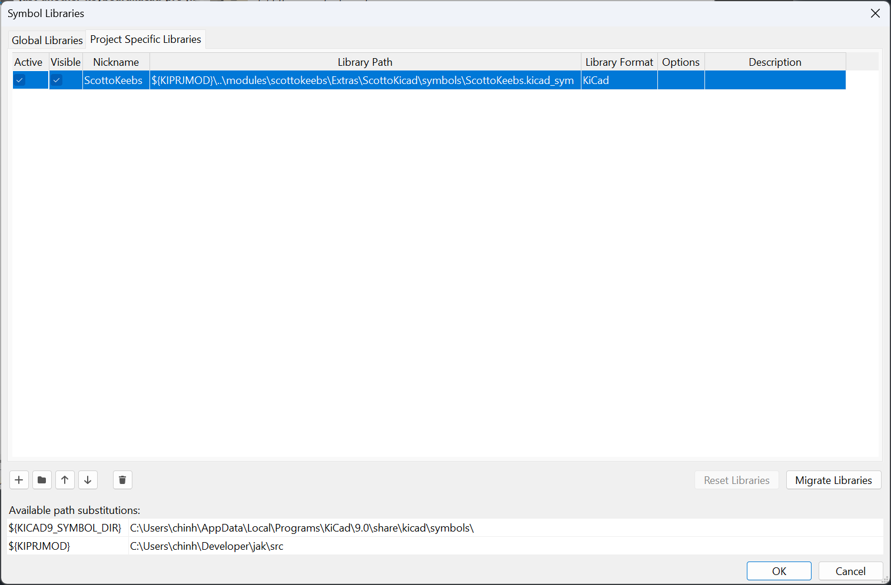

# August 25, 2025
So... uhh... I'm kinda addicted at making random keyboards... now I just need to figure out what this one should be. All I know that it would be in one whole board, contain most of the keys, have the standard staggered layout, and maybe be extensible. Heck. I don't even know what type of switches I want yet. Cherry MX, Kalih Choc, Topre (maybe?). So to start I just started messing around in Keyboard Layout Editor to figure out an overall layout. Fortunately, I was able to find a layout that I was happy with.

**Time Spent: ~1h**

# August 26, 2025
Now I need to figure out the hardware that I want to use. I'm thinking of something like a nrf52840 or maybe a rp2040 with a wireless module. Likely using MX keyswitches.

**Time Spent ~5min**

# September 2, 2025
I lowkey forgot to keep working on this lol. I've made up my mind on the main part of the keyboard, I'll be using a rp2040 with gateron low profile hotswap keyswitches. I might add RGB for fun and maybe do TMR sensors. I however will have change the key layout a bit... or a lot, idk, depends. Either I find a pre-existing bms module or I make my own, and same thing with wireless (I might just steal the pico wireless design lol). An oled display and rotary encoder too.

Now I set up the project by adding git submodules for the libraries that I will use for the keyboard.

**Time Spent ~30min**
